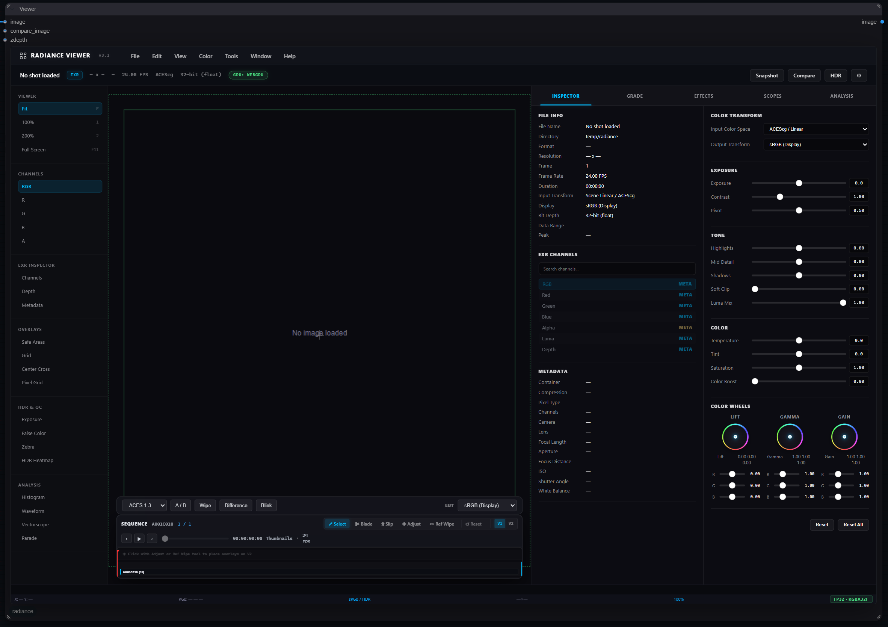
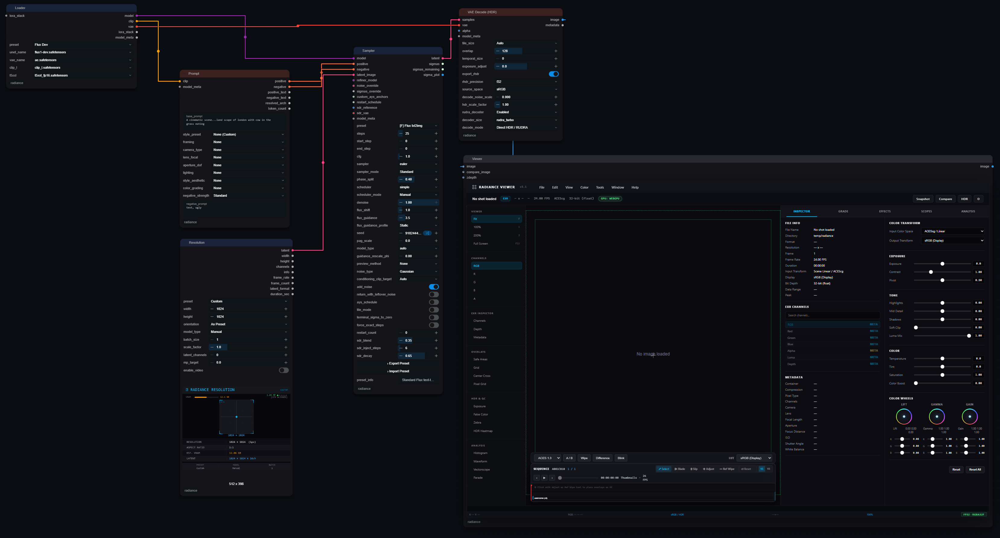

<div align="center">

<br>


**HDR, colour management, VFX tools, and image review inside ComfyUI.**

[](https://github.com/fxtd-studios/radiance/releases/tag/v3.5.0)
[](https://registry.comfy.org/nodes/radiance)
[](LICENSE)
[](https://registry.comfy.org/nodes/radiance)
[](https://huggingface.co/fxtdstudios/RUDRA)
[](https://github.com/FXTD-Studios/RUDRA)

Radiance brings 147 visible nodes into your workflows for processing images and video, working with EXR and ACES, reviewing results, and delivering files to Nuke or DaVinci Resolve.

[Install](#installation) · [Quick start](#quick-start) · [Models](#models-and-downloads) · [Example workflows](#example-workflows) · [Documentation](#documentation) · [Support](#support)

</div>

## What you can do

| Your task | Radiance tools |
|---|---|
| Create and process HDR images | HDR VAE Encode and Decode, SDR → HDR tools, HDR diagnostics |
| Manage colour | ACES, OpenColorIO, colour-space conversion, LUTs, and CDL |
| Review images and video | Viewer with Simple and Advanced modes, scopes, comparison, and playback |
| Prepare VFX shots | Masks, depth, optical effects, estimated passes, and relighting |
| Save and deliver results | Read and Write nodes for images, video, and EXR sequences |
| Organize your work | Project Manager, Workflow Library, Assets, and reusable Gizmos |

<div align="center">

</div>

## Installation

### Install with ComfyUI Manager

1. Open **ComfyUI Manager**.
2. Search for **Radiance** and install it.
3. Restart ComfyUI.
4. Refresh your browser.

You can also find Radiance in the [ComfyUI Registry](https://registry.comfy.org/nodes/radiance).

### Install manually

Run these commands using the Python environment that runs ComfyUI:

```sh
cd ComfyUI/custom_nodes
git clone https://github.com/fxtd-studios/radiance.git
cd radiance
python -m pip install -r requirements.txt
```

Restart ComfyUI and refresh your browser.

**Windows portable users:** use ComfyUI's bundled `python_embeded\python.exe` when installing dependencies.

### Update Radiance

Use **Update** in ComfyUI Manager.

For a Git installation, run these commands inside the `radiance` folder:

```sh
git pull
python -m pip install -r requirements.txt
```

Restart ComfyUI and refresh your browser after updating.

**Upgrading from an older version?** Back up your workflows and check the [migration notes](CHANGELOG.md). Some nodes and widget layouts changed in v3.5.

## Quick start

### Process an existing image

Start with this simple workflow:

**Read → SDR → HDR Universal → Viewer**

1. Load your image with **Read**.
2. Connect it to **SDR → HDR Universal**.
3. Connect the result to **Viewer**.
4. Run the workflow.
5. Add **Write** to save the result as EXR.

The SDR-to-HDR model downloads on first use when downloads are enabled.

### Generate an image

Open the included [starter workflow](workflows/start.json) in ComfyUI.

Select the FLUX.2 Klein 4B distilled model, FLUX.2 VAE, and Qwen3 4B text encoder in the Loader, enter your prompt, and run the workflow. Review the result in the Viewer and connect a Write node to save the image.

The required model files are separate downloads. See [Models and downloads](#models-and-downloads) below.

<div align="center">

</div>

## Models and downloads

### RUDRA for SDR to HDR

[RUDRA on Hugging Face](https://huggingface.co/fxtdstudios/RUDRA) provides the learned SDR-to-HDR model used by **SDR → HDR Universal** and **SDR → HDR Recover**. The default model downloads on first use when downloads are enabled.

For manual or offline installation:

| Model | Download | Save in |
|---|---|---|
| `sdr2hdr_shadow_v1.safetensors` | [Download default model](https://huggingface.co/fxtdstudios/RUDRA/resolve/main/sdr2hdr/sdr2hdr_shadow_v1.safetensors) | `ComfyUI/models/radiance/` |
| Alternative RUDRA image checkpoints | [Browse available models](https://huggingface.co/fxtdstudios/RUDRA/tree/main/sdr2hdr) | `ComfyUI/models/radiance/` |

Create the `radiance` folder if needed. Leave `pixel_checkpoint` empty to use the default model. To prevent automatic model downloads, set `RADIANCE_ALLOW_DOWNLOADS=0` before starting ComfyUI.

**Model licence:** RUDRA weights are licensed for non-commercial use. Read the [RUDRA weights licence](https://huggingface.co/fxtdstudios/RUDRA/blob/main/LICENSE) before use. This is separate from the Radiance codebase licence.

### Models for the starter workflow

The included [starter workflow](workflows/start.json) uses **FLUX.2 Klein 4B distilled**, with 4 sampling steps at 1024 × 1024. Download these three files, place them in the folders below, and start the workflow.

| File | Hugging Face download | Save in |
|---|---|---|
| `flux-2-klein-4b-fp8.safetensors` | [FLUX.2 Klein 4B distilled](https://huggingface.co/black-forest-labs/FLUX.2-klein-4b-fp8/blob/main/flux-2-klein-4b-fp8.safetensors) | `ComfyUI/models/diffusion_models/` |
| `flux2-vae.safetensors` | [FLUX.2 VAE](https://huggingface.co/Comfy-Org/flux2-dev/blob/main/split_files/vae/flux2-vae.safetensors) | `ComfyUI/models/vae/` |
| `qwen_3_4b.safetensors` | [Qwen3 4B text encoder](https://huggingface.co/Comfy-Org/vae-text-encorder-for-flux-klein-4b/blob/main/split_files/text_encoders/qwen_3_4b.safetensors) | `ComfyUI/models/text_encoders/` |

Use the distilled model listed above, not the `base` variant, which needs different sampling settings. Update ComfyUI for FLUX.2 Klein support and review each model's licence. See the [official ComfyUI FLUX docs](https://docs.comfy.org) for model compatibility details.

## Example workflows

Choose a workflow that matches your task:

| Workflow | Purpose |
|---|---|
| [Starter workflow](workflows/start.json) | Generate and review an image |
| [SDR to HDR](workflows/sdr_to_hdr.json) | Convert an existing image to HDR and save EXR |
| [Colour grading](workflows/colour_grade.json) | Adjust colour and save a graded image |
| [HDR VAE](workflows/hdr_vae_encode_decode.json) | Encode, decode, and compare an HDR image |
| [Multipass relighting](workflows/multipass_relight.json) | Estimate passes and relight an image |
| [HDR delivery](workflows/hdr_delivery.json) | Create EXR, HDR10, and SDR outputs |

Drag a workflow JSON file onto the ComfyUI canvas to open it.

## Using the Viewer

Start in **Simple mode** for image review, comparison, and playback. Switch to **Advanced mode** for scopes, colour controls, and detailed inspection.

- Hover or select the Viewer to use its keyboard shortcuts.
- VIDEO inputs can include audio. IMAGE batches do not contain audio.
- Use **Write** nodes for video and sequence export.
- Viewer adjustments affect the preview unless you apply equivalent processing in the workflow.

## Before you start

- **Additional models:** some tools download models on first use. Multipass Estimate requires substantially larger downloads than SDR → HDR.
- **Long-video windowing:** experimental and disabled by default. Some scenes can distort when split into temporal windows.
- **Viewer backend:** WebGL is the default. Optional WebGPU support has feature limitations.
- **Estimated passes:** depth and material predictions are estimates, so results can vary and video may flicker.
- **Temporary previews:** rerun the workflow if ComfyUI's temporary preview files have been removed.

Read the full [known limitations](KNOWN_ISSUES.md).

## Documentation

- [Radiance website](https://www.fxtdstudios.com/radiance-comfyui.html)
- [Node reference](docs/nodes/README.md)
- [Release notes](https://github.com/fxtd-studios/radiance/releases)
- [Changelog and migration notes](CHANGELOG.md)

In ComfyUI, hover over a node or input to read its description.

## Support

If something does not work:

1. Restart ComfyUI and refresh your browser.
2. Check the ComfyUI console for errors or missing dependencies.
3. Confirm dependencies were installed into ComfyUI's Python environment.

[Report an issue](https://github.com/fxtd-studios/radiance/issues) with your Radiance version, ComfyUI version, operating system, error message, and a minimal workflow that reproduces the problem.

## License

Radiance is licensed under [GPL-3.0](LICENSE).

Downloaded model weights have their own licences. Review those terms before using or distributing them.

Built by [FXTD Studios](https://fxtdstudios.com).
